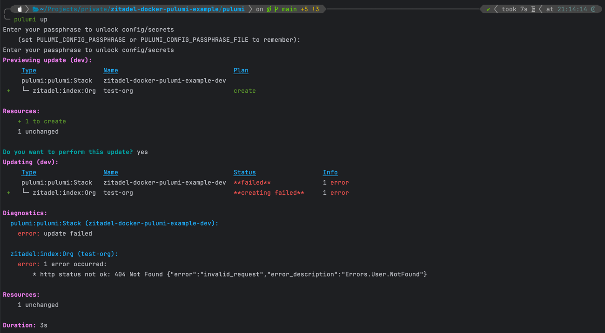
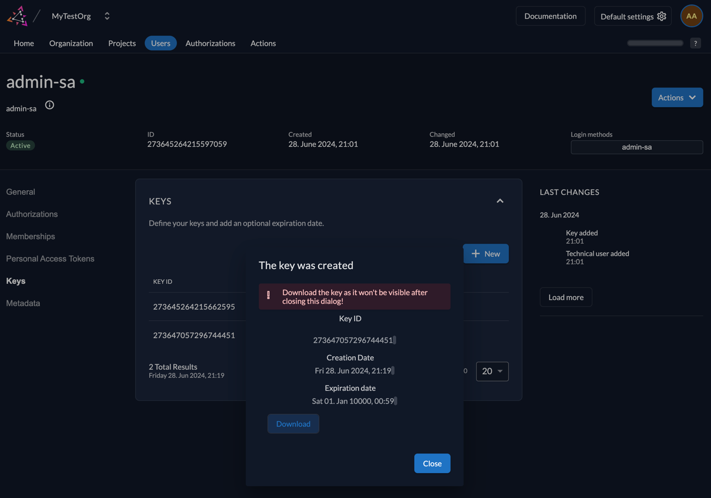
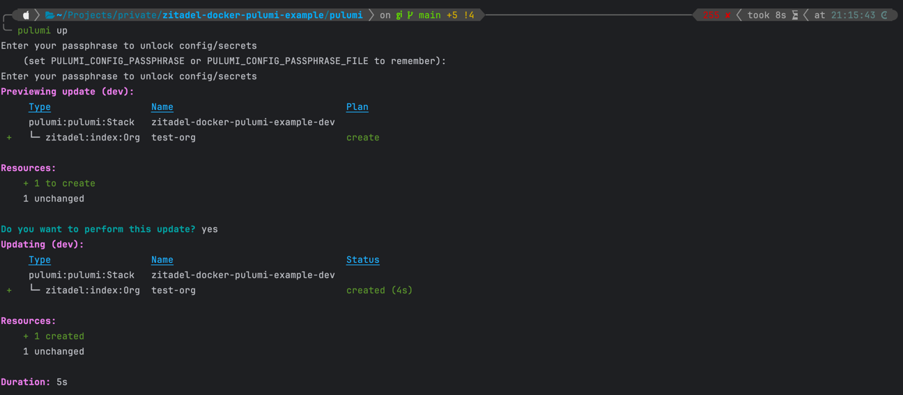

# Provision a Zitadel Docker container with Pulumi Example

This repository contains an example of how to provision a Zitadel Docker container with Pulumi.
It also acts as a reproducer repo to show case that zitadels automatically created machine key is not working.

## Prerequisites

- Docker
- Pulumi

## Step by Step guide on How this Project was created 

1. add basic docker-compose setup to run Zitadel (see 1st commit: 49fad6d1a2903c738249b5ff9260e3f5c2fe861c)
1. add automatic creation of machine user to zitadel init-steps (see 2nd commit: 9dda87de3699ad5719b45eef3ad2ac91d1a8cfde)
1. create the initial machine-key manually
   1. run `docker-compose up` to start Zitadel
   1. navigate to http://localhost:8080 to see Zitadel and login with admin@mytestorg.localhost / Password1!
   1. navigate to "Users" / "Service Users" and click on user "admin-sa" to go to user details
   1. click on "Keys" tab in the sidebar (on the left side)
   1. click on "New" button and "Add" button in the modal
   1. "Key was created" modal will appear --> **download the key**
   1. copy the downloaded file to the file `./zitadel/machine-key.json` (see 3rd commit: 341d310eb64f46f35167ce662a4df2d95d453ec1)
1. Let Zitadel create the machine key of "admin-sa" machine user automatically based `./zitadel/machine-key.json` from now on (see 4th commit: 8b9a7f227d37d52ea4d58cd8b7561a41092aefe0)
1. run `docker-compose up` to start Zitadel and we see the machine key is created automatically
1. init a new pulumi project with `pulumi new` using pulumis typescript template (see 5th commit: b57cf057431b3c2ba09ef10b2635116e0cd7e9b6)
1. add basic zitadel provisioning step to pulumi (see 6th commit: 1fa9a7a9ff2dcee84fabae5c61530af52a0a454e)
   1. zitadel pulumi provider has just been added -> needs a `pnpm install` to install dependencies
1. make pulumi run against local zitadel docker container and wire machine key fileto be used by pulumi (see 7th commit: 0c27f4f973a50b4e26eb082a0dea5fe4d322d11e)
1. kill all docker containers and spin up zitadel via docker compose again to be sure we are fresh
1. **run `pulumi up` to provision zitadel with pulumi**
   1. ⚠️ using machine key applied to "admin-sa" user will fail ⚠️
   1. 
1. create a new machine key for "admin-sa" user and download it
   1. 
1. replace machine key file in project under [./zitadel/machine-key.json](./zitadel/machine-key.json) with downloaded new machine key (see 8th commit: 099d89116462a1b6e0898889d0845a89a04f34f7)
1. **run `pulumi up` again to provision zitadel with pulumi** 
   1. 💡 using new created machine key will work and thereby prove the project setup is working generally 💡
   1. 

   
## Take aways
* The automatically created first instance machine key is not working
   * 🚨 What i could observe is that the keyId of the automatically generated machine key differs from the keyId given in [./zitadel/machine-key.json](./zitadel/machine-key.json) - not sure if this could be a problem
      * at least it would make sense regarding the "Errors.User.NotFound" error we get when running pulumi up with initial machine key
* 😕 manually creating new machine key to work around the issue blocks automation of the whole process
