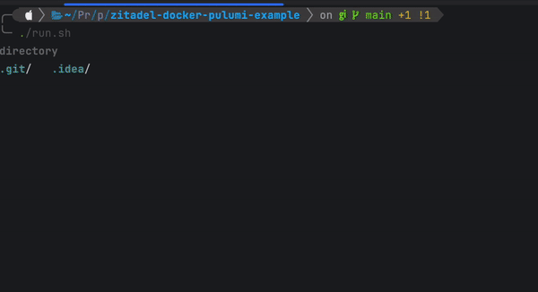

# Provision a [Zitadel](https://zitadel.com/) Docker container with [Pulumi](https://www.pulumi.com/) Example

This repository contains an example of how to provision a Zitadel Docker container with Pulumi.

## Prerequisites

- Docker
- Pulumi
- some node package manager (bun, pnpm, npm, yarn, ... whatever you prefer)

## What it does
it uses docker compose to spin up a Postgres database and a Zitadel instance. (see [docker-compose.yaml](docker-compose.yaml))

To be provision ready it does the following using the [run.sh](run.sh) script:
- Starts a Postgres database
- Starts a Zitadel instance
    - wire Zitadel and Postgres database (see [defaults.yaml](zitadel/Fconfig/defaults.yaml))
    - creating machine user and machine key (see [init-steps.yaml](zitadel/config/init-steps.yaml))
    - since we mount volume to the Zitadel instance, the machine key will be persisted and available on host machine (after running script see [zitadel/secrets/machine-key.json](zitadel/secrets/machine-key.json))
- Use [Pulumi](https://www.pulumi.com/) to provision a [Zitadel](https://zitadel.com/) instance by using [Zitadel pulumi provider](https://www.pulumi.com/registry/packages/zitadel/) (see [pulumi/index.ts](pulumi/index.ts)) and Zitadels formerly created machine-key to run against local docker instance of Zitadel (see [Pulumi.dev.yaml](pulumi/Pulumi.dev.yaml))

## How to use this example
```shell
./run.sh
```


